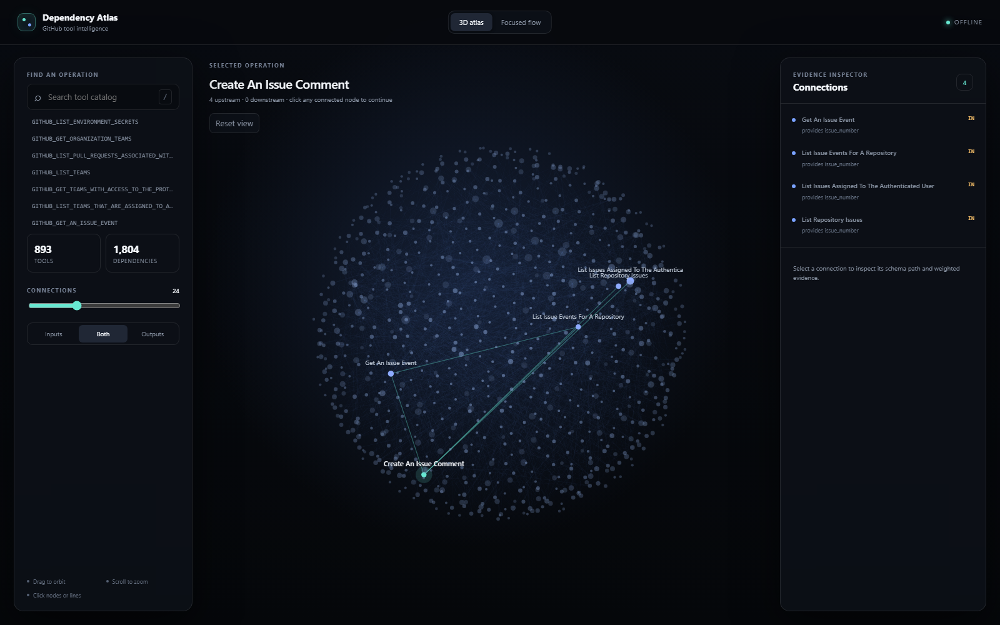
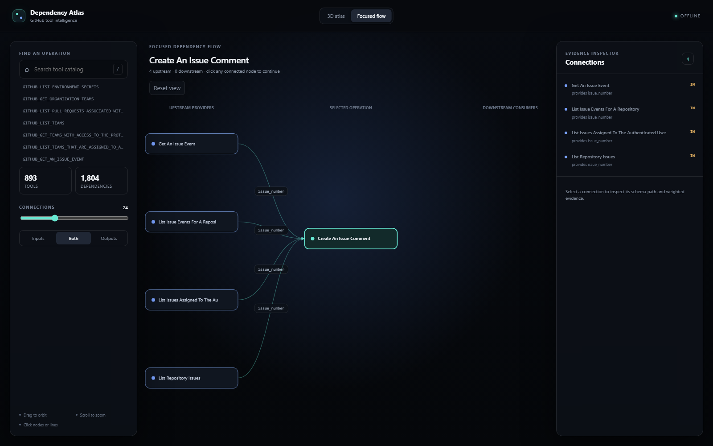

# build a tool dependency graph generator (60-120 mins)

we care about the quality and structure of the dependency relationships you discover

some actions need precursor actions before being able to execute them

a concrete example

1. the tool `GITHUB_CREATE_AN_ISSUE_COMMENT` which needs an `issue_number`
2. which can be got by `GITHUB_LIST_REPOSITORY_ISSUES` as an example, there could be other ways to get an `issue_number` too

a second more dense exmaple
the merge tool `GITHUB_MERGE_A_PULL_REQUEST` needs a `pull_number`, if you only have a branch name you first list the pull requests with `GITHUB_LIST_PULL_REQUESTS` to find the matching one and then you can merge it

when we agentically execute actions inside composio, we need to know either what info to get from the user or what other action we should take before we execute the action.

you are supposed to build a program that generates this dependency graph — a generator that reads a toolkit's tool catalog and outputs the graph, instead of hand-writing it

to keep this limited in scope, we give you [Github](https://docs.composio.dev/toolkits/github) as an example toolkit to build and test against — but your generator should generalize: it reads a toolkit's catalog and produces the graph, so it works for any toolkit, not just this one

the final submission should be a visualized dependency graph where i can see connection (this is not super important just should exist for me to see if graph with edges and nodes)

## deliverable

commit a **generator** at the repo root — a program that produces a `dependency_graph.json` from a toolkit's catalog. we run it: your generator is called with the path to a toolkit's catalog as a command-line argument (e.g. `node src/generate.ts path/to/catalog.json`), and it writes `dependency_graph.json` at the repo root (declare build/run in `generator.json`). it must read the catalog it's given, not hardcode a fixed graph. the graph shape our checks read:

```json
{
  "nodes": [{ "id": "GITHUB_CREATE_AN_ISSUE", "service": "issues" }],
  "edges": [{ "from": "GITHUB_LIST_REPOSITORY_ISSUES", "to": "GITHUB_CREATE_AN_ISSUE_COMMENT", "label": "issue_number" }]
}
```

- each edge is `producer -> consumer`; `label` is the id/field the producer supplies (e.g. `issue_number`, `pull_number`).
- use Composio's tool slugs for node ids (e.g. `GITHUB_CREATE_AN_ISSUE`), taken from the catalog you were given.
- also commit a visualization (nodes + edges you can see) and the tool catalog you use.

## get started

1. the GitHub tool catalog is already provided at `github_catalog.json` — no api key needed.
2. write your generator in `src/generate.ts` to read a toolkit's catalog and produce the graph. run `npm run selfcheck` to try it on `github_catalog.json` as you iterate.
3. use node/tsx or python (`bun` isn't guaranteed when we run your generator).

for language models, use the **AI API credentials** (a Base URL and API key) shown on your Litmus assessment page. they work with the OpenAI SDK: point the client's `baseURL`/`base_url` at that url and pass the key, and call an allowed model such as `openai/gpt-4o`. your usage counts against the assessment's token budget.

you can implement this with whatever language you want, feel free to use language models and coding tools

## submit

once you are done, run `litmus submit` from your assessment folder. make sure your generator (see **deliverable** above) is committed.

## activity tracking

your work is tracked automatically while you work (file changes, git history, and AI-tool prompts) and included when you `litmus submit`. there is nothing to run, just commit often.

NOTE:  Feel free to use LLM, you will be judged by the quality of output, eval...

---

## Implemented solution

This repository contains an evidence-carrying dependency inference pipeline. It does not hardcode GitHub relationships: it normalizes any supplied catalog, recursively indexes required inputs and nested outputs, retrieves bounded type/entity-compatible candidates, optionally asks GPT-5.4 to adjudicate those closed choices, validates every response, and applies a final catalog-provenance firewall before writing the graph atomically.

### Quick start

```bash
npm install
npm run generate -- github_catalog.json
npm test
npm run typecheck
```

`npm run generate` loads `.env` when present. Copy `.env.example` and set `OPENAI_API_KEY`, `OPENAI_BASE_URL`, and optionally `DEPENDENCY_GRAPH_MODEL`. Without complete credentials—or when a batch exhausts its retries—the generator falls back per batch to a deterministic policy and still produces a valid graph.

Outputs:

- `dependency_graph.json`: evaluator-facing nodes and producer-to-consumer edges;
- `inference_report.json`: ranked candidates, schema paths, evidence weights, selection state, model rationale, fallback issues, and run statistics;
- `evaluation_report.json`: structural, topology, gold-set, and offline-comparison metrics.

### Architecture

```text
catalog JSON
  -> normalization and validation
  -> recursive required-input / nested-output indexing
  -> identity, type, entity, scope, and operation evidence
  -> bounded top-K candidate cases
  -> closed-choice GPT-5.4 adjudication (optional)
  -> strict response validation + per-case/batch fallback
  -> graph integrity firewall
  -> atomic graph + evidence report
```

The model cannot invent graph identifiers: it may select only supplied candidates. The integrity firewall independently rejects non-catalog nodes, dangling endpoints, self-edges, and labels that are not required consumer inputs.

The deterministic path is deliberately semantic rather than a single score cutoff. It prefers shallower canonical output paths, rejects mutation responses whose produced resource does not match the requested input, abstains from ambiguous free-form names, and recovers low-scoring generic create results only when action subject, consumer subject, shared request scope, and direct response path all agree. This makes the fallback a useful inference engine rather than merely an availability mechanism.

### Evaluation

```bash
npm run evaluate -- github_catalog.json dependency_graph.json evaluation_report.json
npm run evaluate:live -- github_catalog.json evaluation/github-gold.json evaluation/live-calibration-report.json
```

The expanded 24-case hand-reviewed set includes canonical examples, low-score generic IDs/numbers, lexical-cap recovery, direct create chains, conflicting resource qualifiers, incidental nested identifiers, and misleading name matches. The checked-in deterministic artifact scores **24/24 (100%)**, with 100% positive candidate recall, 100% positive selection recall, and 100% negative rejection. The earlier fully online GPT-5.4 run scored 87.5%; a broader prompt experiment fell to 75% and was rejected. These historical results remain checked in so tuning decisions are inspectable rather than rewritten after the fact.

### Visualization

```bash
npm run visualize
```

Open `http://127.0.0.1:4173`. Dependency Atlas combines a draggable, zoomable 3D overview of the complete graph with a focused flow mode for one operation. Search, direction filters, connection limits, hub-scaled nodes, selected-neighborhood emphasis, and a connection drawer make the dense graph navigable. Selecting a connection reveals exact schema mappings, rank, confidence, score, rationale, and weighted evidence. It uses a dependency-free Canvas renderer and requires no external network.

Only the selected operation's highlighted edges are interactive in the 3D view, preventing the faint global context from competing for clicks. Focused Flow renders readable upstream and downstream cards, directional arrows, and field labels; `?view=focus` opens it directly.





### Quality and resilience

- 76 deterministic tests cover catalogs, recursive schemas, candidate ranking, metamorphic stability, semantic selection guards, graph integrity, atomic writes, malformed model output, fabricated selections, retries, concurrency, and partial fallback.
- Full GitHub catalog: 893 nodes, 661 identifier-like required inputs, 26,161 indexed output fields, 610 candidate cases, and 4,200 bounded candidates.
- Final deterministic graph: 1,804 validated edges, zero dangling edges, and complete catalog provenance.
- Offline generation is byte-stable and completes in roughly 6 seconds on the supplied catalog.
- Model calls use bounded batches, concurrency control, retryable-error backoff, strict JSON validation, and per-batch fallback. Credentials are never required for a correct run.
- Known limitations and rejected tuning experiments are documented rather than hidden.

### Repository map

- `src/catalog.ts`, `src/schema.ts`: defensive catalog normalization and recursive schema evidence.
- `src/candidates.ts`, `src/selection.ts`: bounded retrieval, weighted features, and deterministic semantic policy.
- `src/model-protocol.ts`, `src/adjudicator.ts`: closed-choice model protocol, validation, retries, and fallback.
- `src/graph.ts`, `src/generate.ts`: integrity firewall, atomic outputs, and CLI orchestration.
- `src/evaluate.ts`, `evaluation/`: reproducible structural and hand-reviewed evaluation.
- `visualization/`: local 3D atlas, focused flow view, and evidence inspector.
- `plan.md`: staged architecture, risks, branching strategy, and acceptance gates.

### Release gate

```bash
npm test
npm run typecheck
npm run selfcheck
npm run evaluate -- github_catalog.json dependency_graph.json evaluation_report.json
```

The generator writes through a temporary file and rename, so interruption cannot leave a partially written graph. Runs are deterministic without model credentials; online adjudication is optional and every model-selected edge still passes the same structural firewall.
